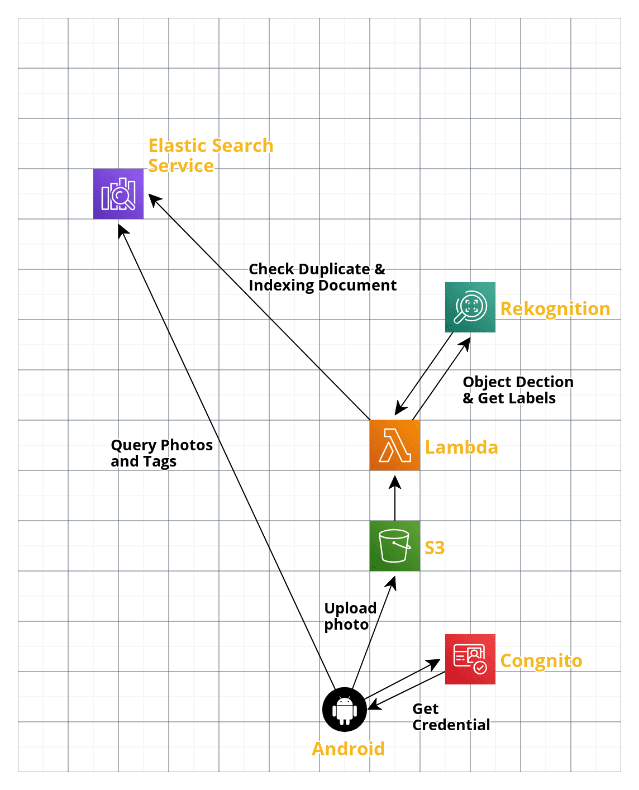
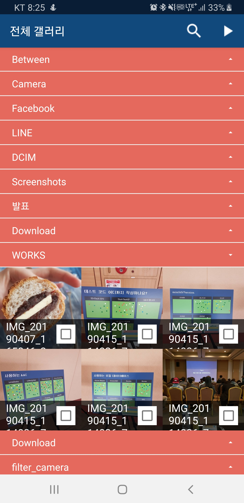
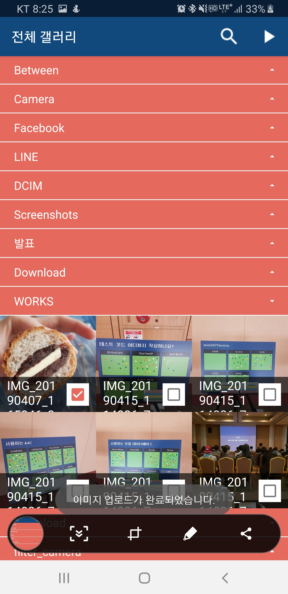
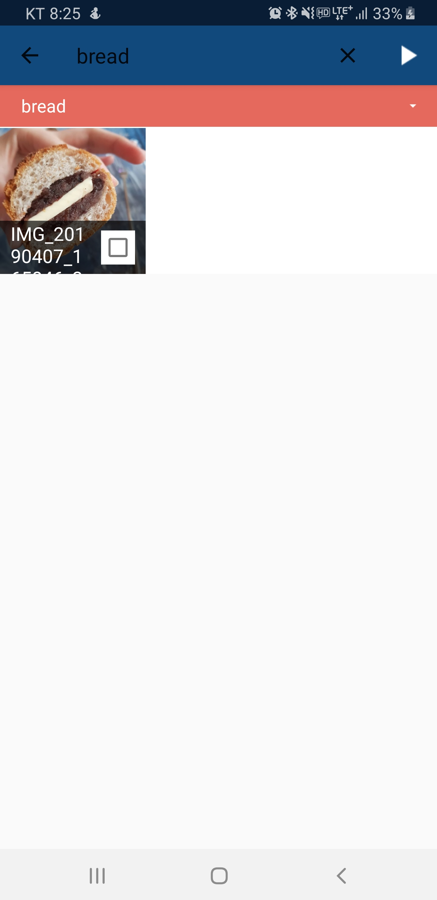
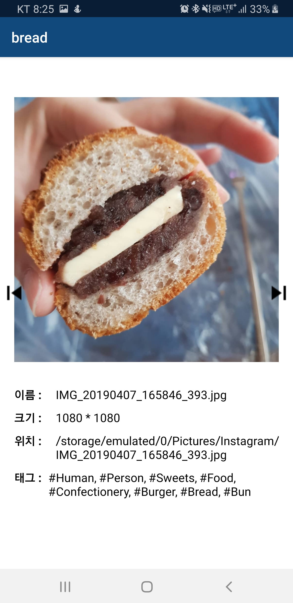
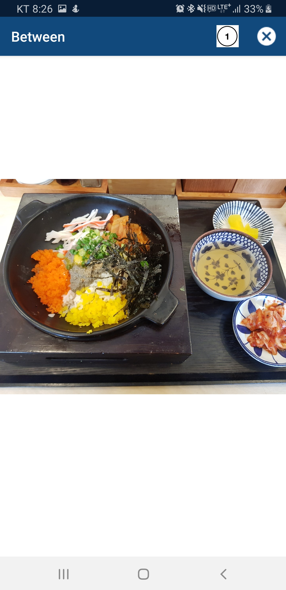

## PhotoTagger🔖

#### Android와 AWS를 함께 써보기 위한 토이 프로젝트🤖입니다.

PhotoTagger는 머신러닝을 통해 사진안의 Object를 인식하여 사진을 Tag🔖명으로 검색할 수 있도록 만든 안드로이드 어플리케이션입니다!😌

소소하게 사진 슬라이드쇼도 볼 수 있습니다.

#### AWS 전체 아키텍쳐

[전체 AWS Role 참고](./permissions.md)

  

#### 사용한 Dependency들

( #aws-android-sdk #retrofit #okhttp3 #butterknife #glide)

~~~

    implementation 'com.android.support:appcompat-v7:27.1.0'
    implementation 'com.android.support.constraint:constraint-layout:1.0.2'
    implementation 'com.android.support:design:27.1.0'
    implementation 'com.amazonaws:aws-android-sdk-s3:2.6.+'
    implementation 'com.amazonaws:aws-android-sdk-cognito:2.6.+'
    implementation ('com.amazonaws:aws-android-sdk-mobile-client:2.6.+@aar') { transitive = true }
    implementation 'com.squareup.retrofit2:retrofit:2.7.1'
    implementation 'com.squareup.okhttp3:okhttp:3.11.0'
    implementation 'com.squareup.okhttp3:logging-interceptor:3.11.0'
    implementation 'com.squareup.retrofit2:converter-gson:2.4.0'
    annotationProcessor 'com.jakewharton:butterknife-compiler:8.8.1'
    implementation 'com.jakewharton:butterknife:8.8.1'
    implementation 'com.github.bumptech.glide:glide:4.8.0'
~~~

#### Preview

##### 아래와 같이 갤러리 별로 사진을 불러오고 체크박스를 통해 S3에 저장할 수 있습니다.

##### S3에 저장된 이미지는 자동으로 태깅이 완료됩니다.

(사진을 많이 띄우는 것이 부담스러운 작업이기 때문에 각 갤러리는 하나만 오픈될 수 있도록 하며 RecyclerView에는 EndlessScrollListener를 달아 갤러리 안의 모든 이미지를 한 번에 불러오지 않게 하였습니다.)

[EndlessScrollListener 참고](https://github.com/codepath/android_guides/wiki/Endless-Scrolling-with-AdapterViews-and-RecyclerView)

  
  

##### 따라서 아래와 같이 S3에 올라간 사진은 Tag로 검색할 수 있습니다.

##### 사진을 눌러 상세 페이지에 들어가면 해당 사진의 태그명들을 볼 수 있습니다.

  
  

##### 그리고 소소한 슬라이드쇼...🤗 (상단 숫자버튼을 통해 슬라이드쇼 시간 조절)

  

#### 구현 TODO

- [x] 안드로이드 소스 리팩토링 - 계속 진행
- [x] Gallery 하나만 Open되도록 수정
- [x] EndlessScrollListener달기
- [x] 권한 설정
- [x] 권한 정리해서 리드미로 업로드
- [x] Cognito 추가 및 S3 권한 할당
- [x] 안드로이드에서 S3로 이미지 전송
- [ ] 안드로이드에서 S3에 있는 파일인지 확인
- [x] Galley 나누기 버그
- [ ] 슬라이드쇼 Interval 버튼 이미지 안바뀌는 버그
- [x] S3 to Rekognition Lambda 생성
- [x] Elastic Search 추가
- [x] AddToES Lambda 생성
- [x] Android SearchView 추가
- [x] Android에서 query요청 추가
